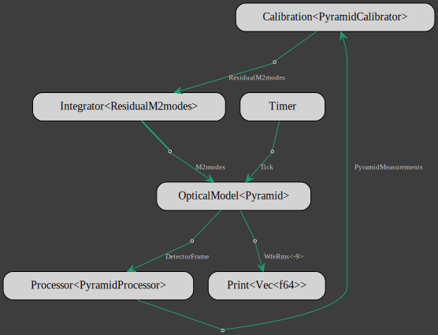

# Complete model

To compute the pyramid reconstructor,
 a feature needs to be added to the [gmt_dos-clients_crseo] crate:
```bash
cargo add gmt_dos-clients_crseo --features faer
```

The complete closed-loop NGAO model is given below:
```rust,no_run,noplayground
{{#include ../../../optical-model-pym/src/main.rs}}
```
The model flowchart:


[gmt_dos-clients_crseo]: https://crates.io/crates/gmt_dos-clients_crseo