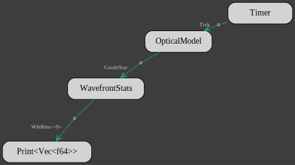

# Dynamic Optical Model

To bring the optical model to life, we need to introduce [actors], 
and the simplest way is to use [actorscript]. 
Here we add the [actorscript] dependency to the crate manifest:
```bash
cargo add gmt_dos-actors
```

The beating heart of the model is going to be provided by the [Timer] client from the [gmt_dos-clients] crate:
```bash
cargo add gmt_dos-clients
```

The data that the actors are exchanging are tagged with some type parameters that are provided by the [gmt_dos-clients_io] crate:
```bash
cargo add gmt_dos-clients_io
```

With the help of the new dependencies, we re-write the `main` script as
 ```rust,no_run,noplayground
{{#include ../../../optical-model/src/main.rs}}
 ```

 We've added:
 
  *  a timer that gives a beat 10 times in a row:
```rust,no_run,noplayground
{{#include ../../../optical-model/src/main.rs:11}}
```
  * the [Print] client to display the wavefront error RMS in nm with 3 digits precision:
```rust,no_run,noplayground
{{#include ../../../optical-model/src/main.rs:15}}
```

The `actorscript` macro inserts each client into its own actor and links them together according to the prescribed data flow:
the timer gives the beat to the optical model, 
at each beat the optical model ray traces through the GMT to the exit pupil,
computes the wavefront RMS and
 passes the value to [Print] that displays it.

After runnning the script with
 ```bash
cargo run
```
one should see `[[+0.797]]` printed consecutively 10 times at the terminal prompt.

For a faster execution, you can instead run the script with
 ```bash
cargo run --release
```

The script also produces a flowchart of the model similar to this one:


[actors]: https://crates.io/crates/gmt_dos_actors
[actorscript]: https://docs.rs/gmt_dos-actors_dsl/latest/gmt_dos_actors_dsl/
[gmt_dos-clients]: https://crates.io/crates/gmt_dos-clients
[Timer]: https://docs.rs/gmt_dos-clients/4.0.0/gmt_dos_clients/timer/struct.Timer.html
[gmt_dos-clients_io]: https://docs.rs/gmt_dos-clients_io
[WavefrontStats]: https://docs.rs/gmt_dos-clients_crseo/latest/gmt_dos_clients_crseo/struct.WavefrontStats.html
[Print]: https://docs.rs/gmt_dos-clients/4.0.0/gmt_dos_clients/print/struct.Print.html